# Portafolio de Desarrollo Web Full-Stack

Este repositorio reune diferentes secciones con proyectos de desarrollo web full-stack desarrollados, orientados a la construcción de aplicaciones que integran frontend, backend y datos.

Por políticas de privacidad los proyectos se presentan únicamente mediante capturas de pantalla.

#### Otros portafolios: [Ingeniería de Datos](https://github.com/kersseek/data-engineer-path)

## Proyectos

### Campaña publicitaria para reactivación de clientes

Es un proyecto de promoción interactiva donde los usuarios pueden participar en juegos, acumular puntos y redimir premios.

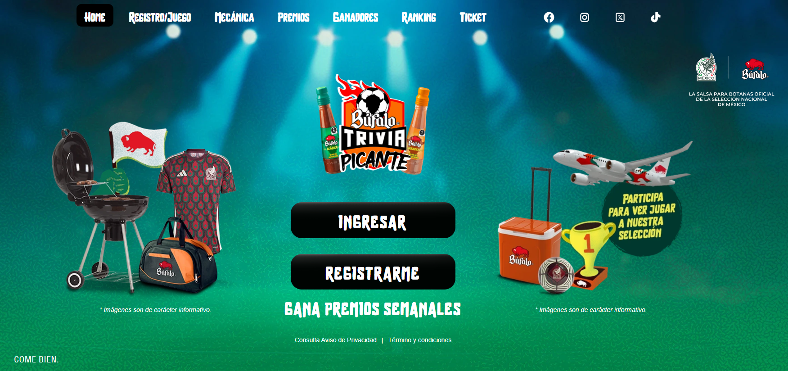

### LLM knowledge graph builder

LLM knowledge graph builder es una herramienta interactiva que permite a los usuarios construir y visualizar grafos semánticos basados en una ontología predefinida para garantizar un flujo eficiente de datos, procesamiento semántico y una interfaz intuitiva.

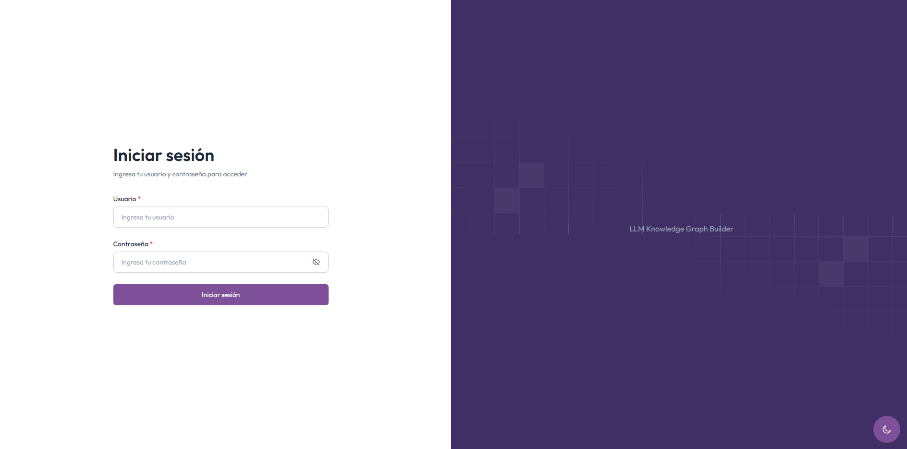

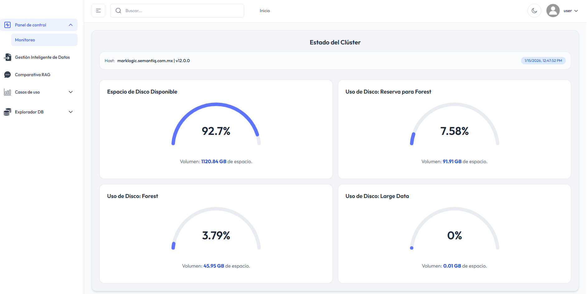

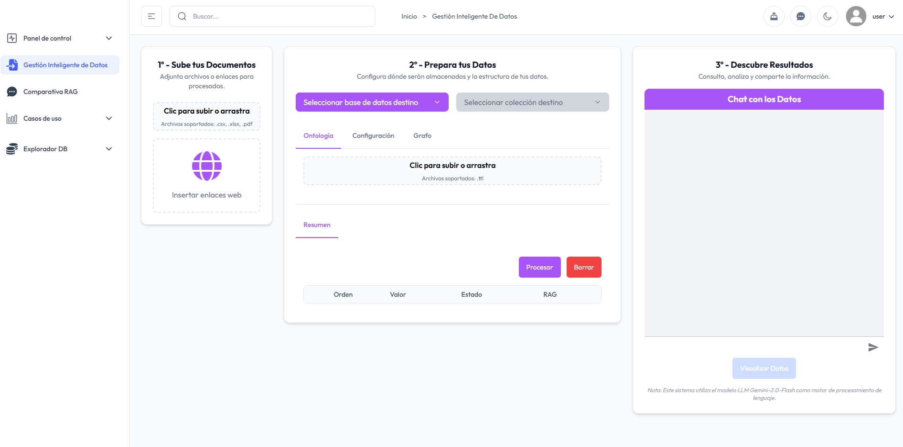

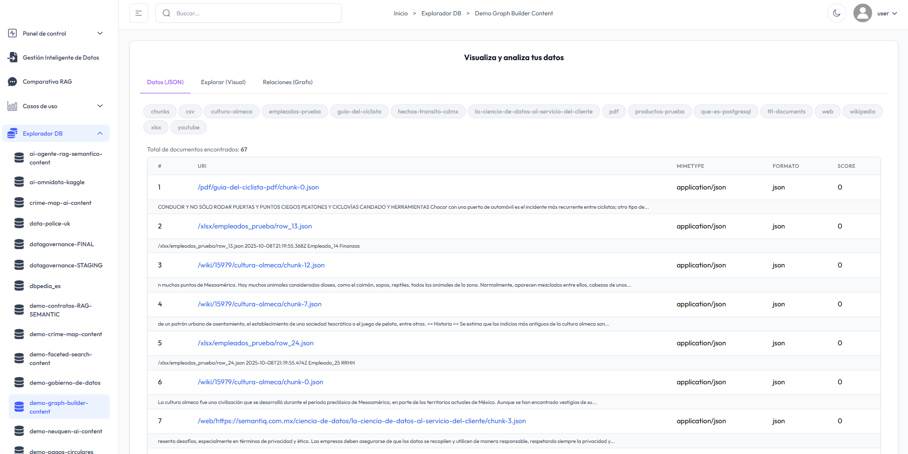

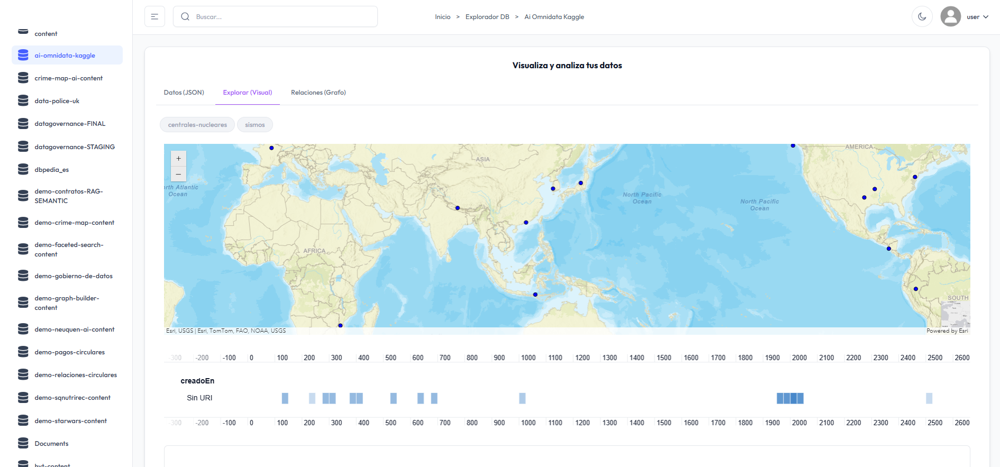

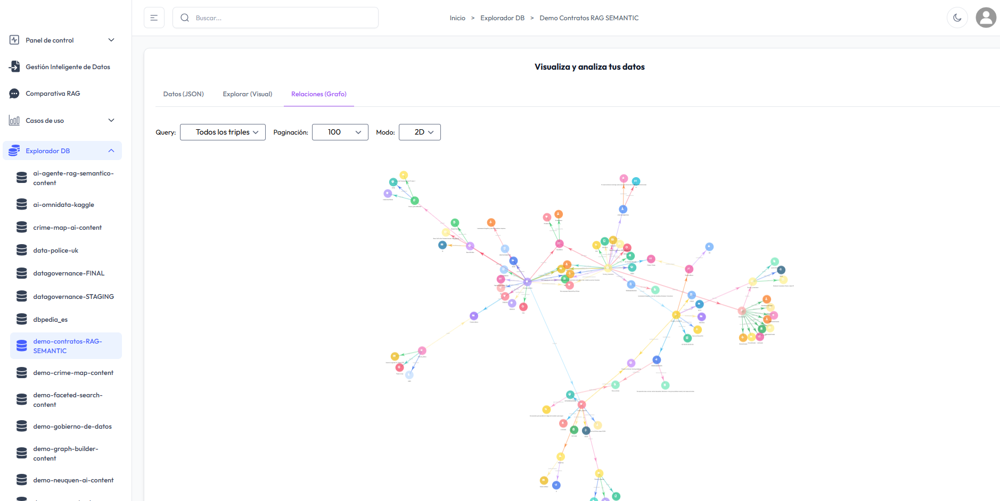

### Gobernanza de datos

Aplicación orientada a la gestión y gobernanza de datos que permite visualizar, organizar y monitorear información facilitando el control.

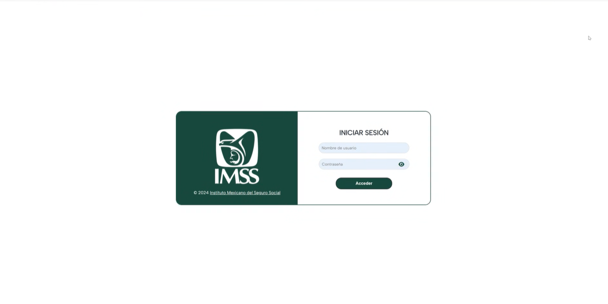

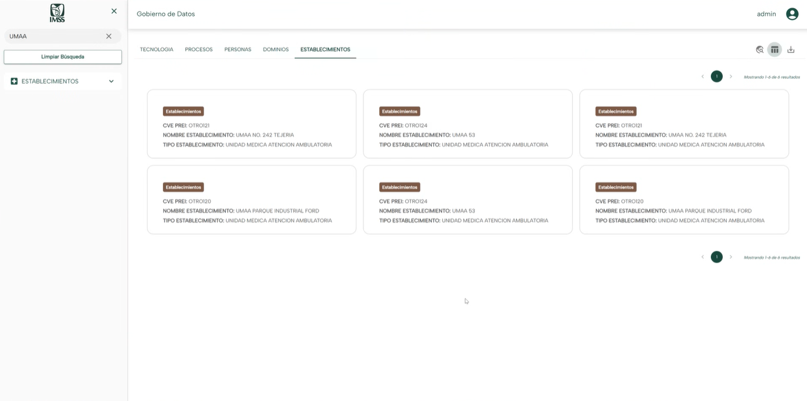

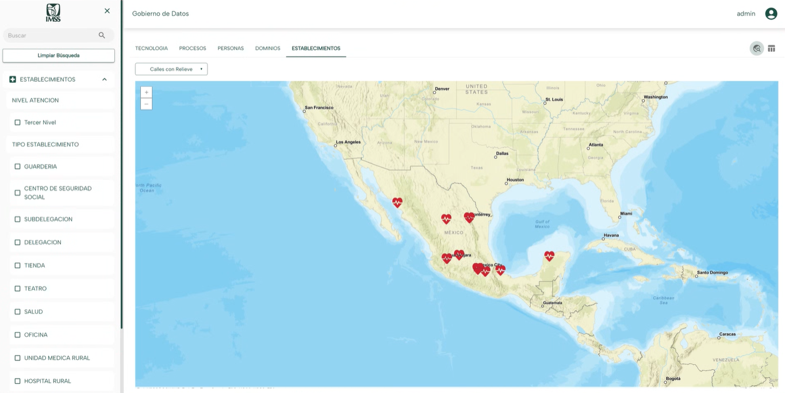

### Aseguradora

Desarrollada para el sector asegurados se centra en la visualización y gestión de información.

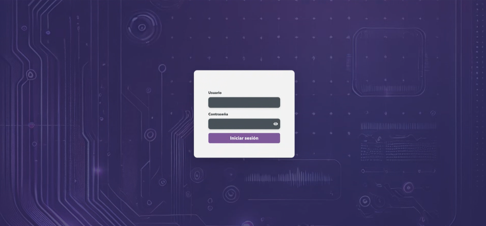

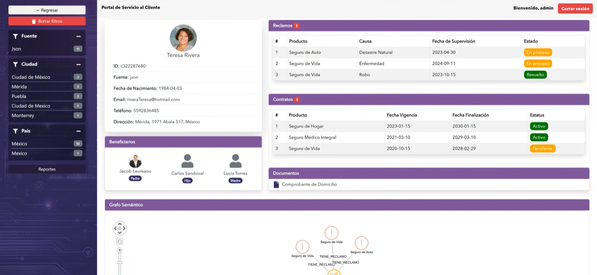

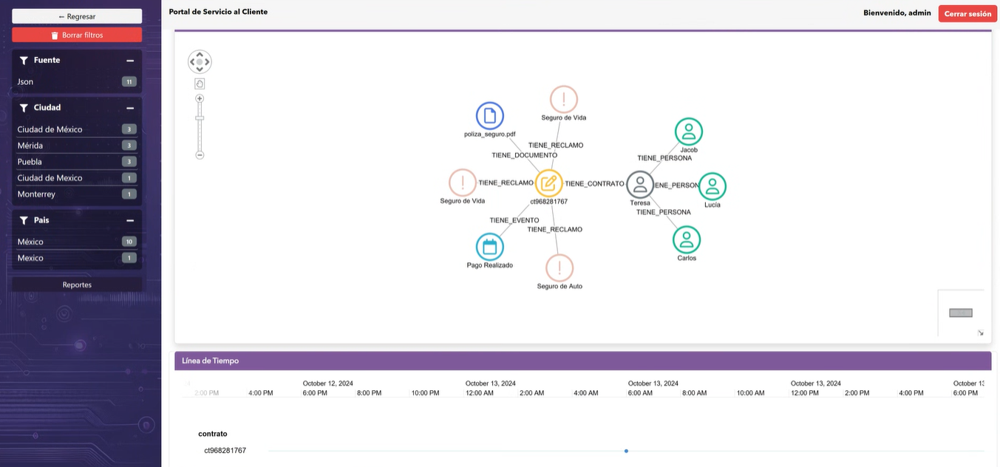
